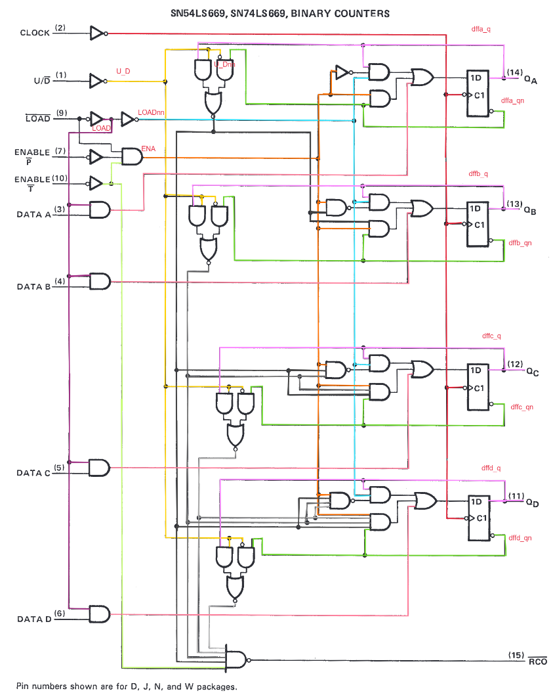

# sn74ls669_verilog



I've created this model for proper Verilog simulation of a LS669 Up/Down 4-bit binary counter used
in bigger designs. Is entirely based on the TI datasheet schematics. The gate delay and dff timings
are based on estimations to be able to run the counter up 32MHz.

## Run the simulation with Icarus Verilog:
```
iverilog -o ls669_test sn74ls669_tb.v sn74ls669.v
vvp ls669_test
gtkwave dump.vcd
```
